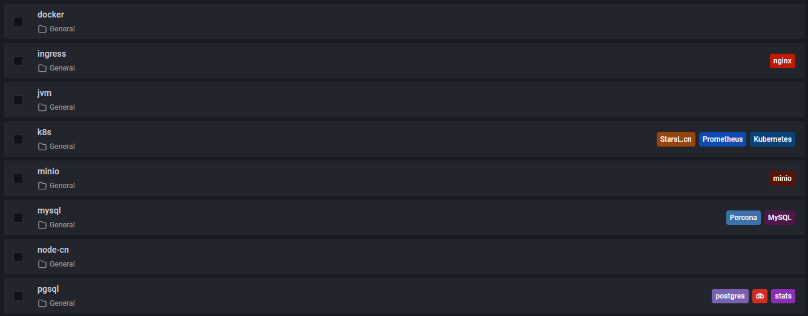
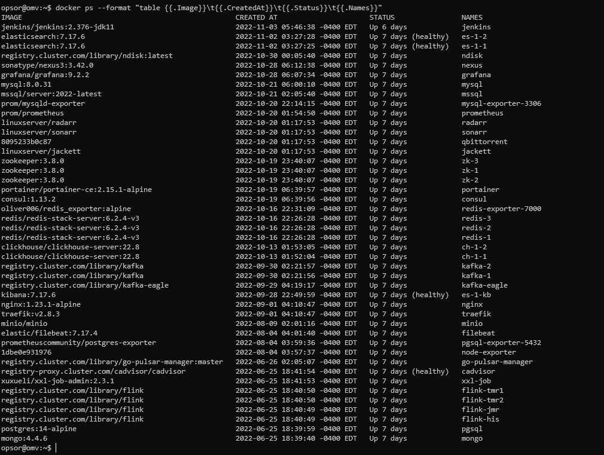
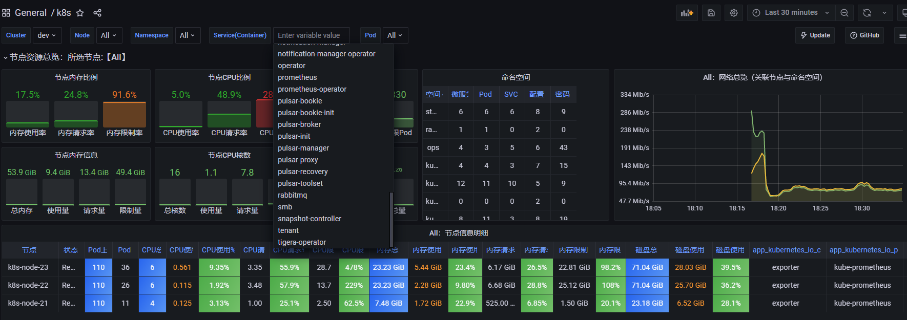
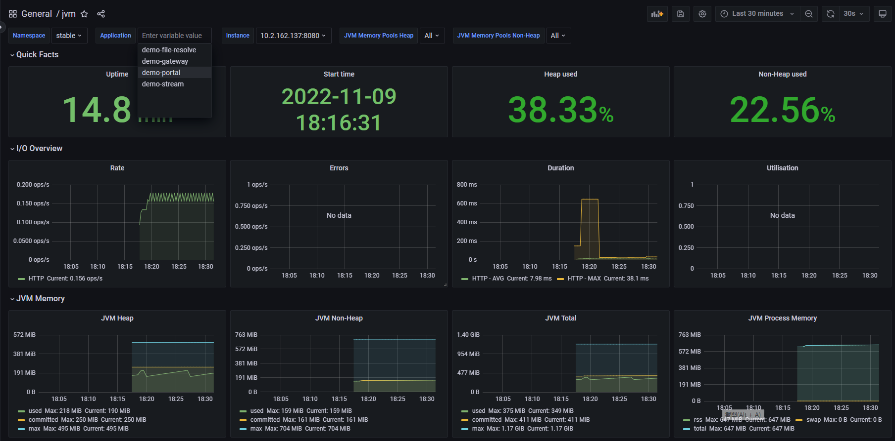

# Clone After
```shell
git config filter.secret_param.clean 'sh .gitignore-secret_param.sh %f'
git config filter.secret_param.smudge 'sh .gitignore-secret_param.sh %f'
```

# linux(Centos Stream 9,Ubuntu 22.04)
```
jenkins             # ci/cd share library pipeline template
server
├── chart           # kubesphere集群管理 istio服务治理   prometheus集群监控 数据库等中间件
├── docker          # jellyfin流媒体影音 traefik反向代理 pulsar消息队列     minio对象存储等应用
├── init            # linux: install docker k8s 集群初始化
├── omv             # nas: openmediavault
├── router          # 软路由: openwrt
```
# grafana

# docker

# k8s

# jvm
